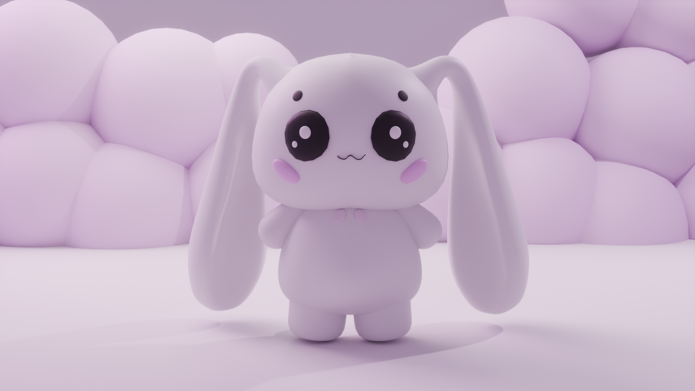
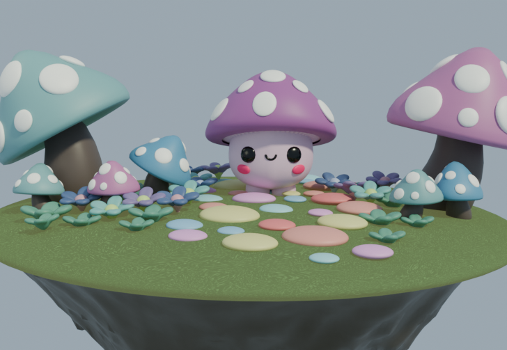

## Hi, I'm Vidhi 👋

💻 Developer | 🎨 3D Artist

I build cool tech projects and create 3D visuals using Blender.

---

### ⚡ Skills

* 💻 Programming: Python, C++, JavaScript, HTML, CSS, OpenCV
* 🎨 3D: Blender (Modeling, Lighting, Rendering)

---

### 🚀 Projects

* Virtual Air Writing System
* AI Interview System
* 3D Product Renders

---

### 📫 Connect with me

* LinkedIn: https://www.linkedin.com/in/vidhi-jain-a083862b7/

---
### 🎨 My 3D Work

<video src="https://github.com/user-attachments/assets/61482a3f-be35-4b8c-ab26-4a78697141da" width="500" autoplay loop muted playsinline></video>
https://github.com/user-attachments/assets/61482a3f-be35-4b8c-ab26-4a78697141da
